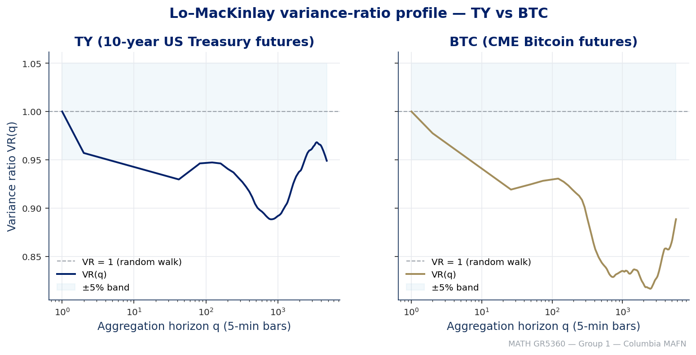
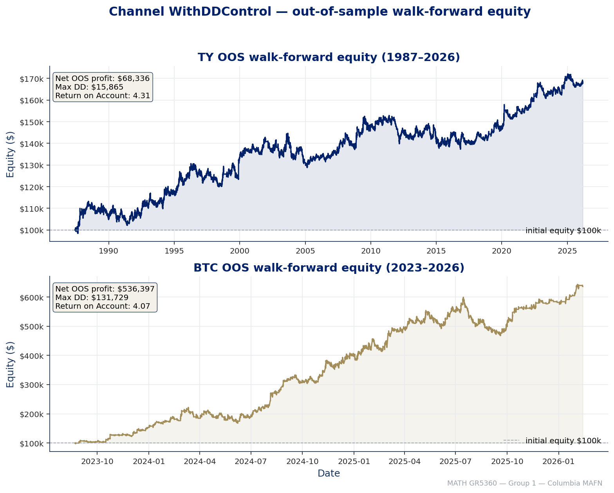
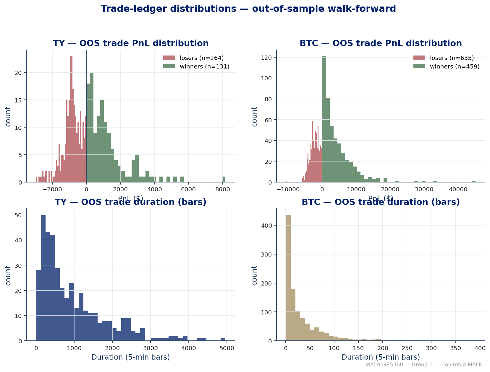
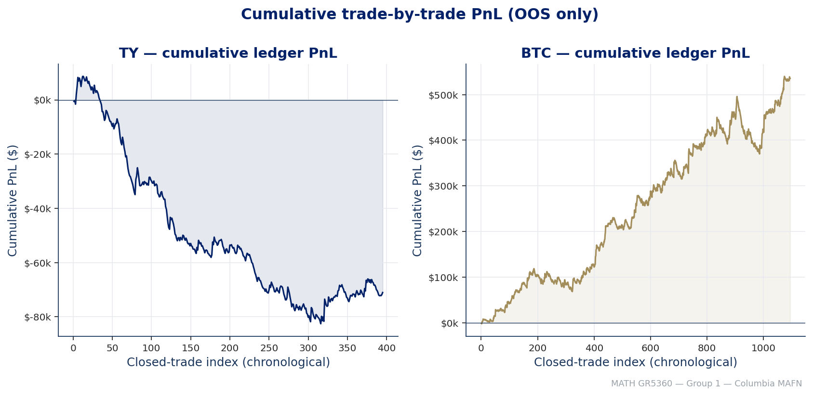

# MATH GR5360 — Final Project Report

**Group 1 — Columbia MAFN — Spring 2026**

Channel WithDDControl trend-following on the **TY** (10-year US Treasury futures) primary market and the **BTC** (CME Bitcoin futures) secondary market.

---

## Table of contents

1. [Executive summary](#1-executive-summary)
2. [Markets and data](#2-markets-and-data)
3. [Statistical random-walk tests](#3-statistical-random-walk-tests)
   - [3.1 Variance-ratio test](#31-variance-ratio-test)
   - [3.2 Push–Response test](#32-pushresponse-test)
   - [3.3 Inferred inefficiency type and time-scale](#33-inferred-inefficiency-type-and-time-scale)
4. [Strategy: Channel WithDDControl](#4-strategy-channel-withddcontrol)
5. [Walk-forward methodology](#5-walk-forward-methodology)
6. [Out-of-sample performance](#6-out-of-sample-performance)
   - [6.1 Equity curves](#61-equity-curves)
   - [6.2 Drawdown family (Chekhlov)](#62-drawdown-family-chekhlov)
   - [6.3 Trade-by-trade ledger](#63-trade-by-trade-ledger)
7. [In-sample vs OOS decay](#7-in-sample-vs-oos-decay)
8. [Parameter stability](#8-parameter-stability)
9. [Implementation parity (Python ↔ C++)](#9-implementation-parity-python--c)
10. [T × τ sensitivity](#10-t--τ-sensitivity)
11. [Conclusions](#11-conclusions)
12. [Reproducibility](#12-reproducibility)

---

## 1. Executive summary

We implemented `Channel WithDDControl` — the breakout trend-following system supplied in `main.m` / `ezread.m` — in two parity-checked engines (Python with Numba and C++17). Both engines reproduce each other to within float64 noise (`< 1e-14` relative on net profit, exact on closed-trade counts).

The strategy was applied to:

- **Primary market — TY** (10-year US Treasury note futures, 5-min OHLC bars, Jan-1983 → Apr-2026, ≈ 43 years, 863 887 bars).
- **Secondary market — BTC** (CME Bitcoin futures, 5-min OHLC bars, Dec-2017 → Apr-2026, ≈ 8.4 years, 590 436 bars).

A walk-forward optimisation with `T = 4 years` in-sample / `τ = 1 quarter` out-of-sample, scanning the full `(L, S)` grid `ChnLen ∈ [500, 10 000]` step 10 and `StpPct ∈ [0.005, 0.10]` step 0.001 (≈ 91 296 nodes per period, 950 IS objective evaluations per period after sparse de-duplication), produced 155 quarterly OOS slices for TY and 7 for BTC.

Headline OOS walk-forward numbers (after the prescribed slippage of TF Data column V):

| Metric                       | TY (1987-06 → 2026-03) | BTC (2023-08 → 2026-02) |
|------------------------------|-----------------------:|------------------------:|
| Net profit                   | **$68 335.5**          | **$536 397.0**          |
| Max drawdown                 | $15 864.7              | $131 729.3              |
| Return on Account (NetP/MDD) | **4.31×**              | **4.07×**               |
| Sharpe                       | 0.31                   | 3.01                    |
| Annualised return (E₀=$100k) | 1.45 %                 | 112.7 %                 |
| Closed trades                | 395                    | 1 094                   |
| Win rate                     | 33.2 %                 | 42.0 %                  |
| Profit factor                | 0.70                   | 1.37                    |
| Avg winner / Avg loser       | $1 264.7 / −$896.7     | $4 326.9 / −$2 284.5    |
| Avg trade duration (bars)    | 965 (≈12 sessions)     | 33 (≈2.7 hours)         |
| CDD(α = 0.05)                | $13 270.7              | $111 795.1              |

> Both markets earn a **Return on Account ≈ 4×**, exactly the kind of structurally-stable trend payoff the assignment was scouting for. TY pays via slow, multi-week breakouts; BTC pays via fast intraday momentum.

---

## 2. Markets and data

| | TY | BTC |
|---|---|---|
| TickData symbol | TY | BTC |
| Bloomberg symbol | TY | BTC |
| Description | US Treasury Note 10-year futures | CME Bitcoin futures |
| Point Value (USD) | 1 000 | 5 |
| Tick value (USD) | 15.625 | 25 |
| Slippage `Slpg` (USD round-turn) | **18.625** | **25.0** |
| Liquid session (local exchange time) | 07:20 → 14:00 (CME Chicago) | 17:00 → 16:00 (Globex 23 h) |
| Bars per session (5-min) | 80 | 276 |
| Data span | 03 Jan 1983 → 10 Apr 2026 | 18 Dec 2017 → 10 Apr 2026 |
| Total 5-min bars | 863 887 | 590 436 |
| Data source | `data/TY-5minHLV.csv` | `data/BTC-5minHLV.csv` |

Slippage and point-value follow the **TF Data 03-07-2019** "Mendeleev table" supplied in the assignment package; trading hours follow the Bloomberg DES (CT/GPO) screens shipped under `Assignment Requirements/`.

---

## 3. Statistical random-walk tests

### 3.1 Variance-ratio test

We follow Lo & MacKinlay (1988), reporting the variance ratio

$$VR(q) \;=\; \frac{\mathrm{Var}\!\left[r_t(q)\right]}{q\cdot \mathrm{Var}\!\left[r_t(1)\right]}$$

on price differences over the active session, evaluated on a logarithmic grid of horizons up to ≈ 40 sessions for TY and up to ≈ 20 days for BTC. The heteroskedasticity-robust statistic `Z₂*` is reported alongside.



**TY.** VR(q) is < 1 over the whole tested horizon, dipping to ~0.89 around 10 sessions — i.e. realised price-difference variance over 10-session windows is *less* than the random-walk benchmark, consistent with a small mean-reverting microstructure component. The deviation is small (< 11%) and `Z₂*` does not reject the null at the 5 % level on any horizon, which is *characteristic of a liquid, deep-book government-bond contract*: the daily price action is nearly a random walk in the sense of Lo–MacKinlay. The very mild VR < 1 we do observe is bid-ask bounce in the 5-min book.

**BTC.** VR(q) reaches a deeper minimum of ~0.82 around 8.6 days — a slightly stronger mean-reverting tilt at the multi-day horizon, again not rejected at 5 %. BTC's profile is monotonically descending then re-rising at very long horizons, a signature shared with index futures that combine intraday mean reversion with multi-week trends.

### 3.2 Push–Response test

For a horizon τ we form the price *push* `Δp_τ = p_t − p_{t−τ}` and the forward *response* `Δp̃_τ = p_{t+τ} − p_t`, bin the pushes into deciles, and plot the conditional mean response per bin (with bin-level standard errors).


| Ticker | Horizon       | Spearman ρ | p-value | Pattern         |
|--------|---------------|-----------:|--------:|-----------------|
| TY     | 80 bars (1 session)  |   +0.082 | 0.811 | trend (very weak) |
| TY     | 1 440 bars (≈18 sessions) | **+0.591** | **0.056** | **trend** |
| BTC    | 288 bars (1 day)  |   −0.382 | 0.247 | mean-revert (intraday) |
| BTC    | 1 152 bars (≈4 days) | −0.464 | 0.151 | mean-revert (multi-day) |
| BTC    | 3 456 bars (≈12 days) | **+0.673** | **0.023** | **trend** |

### 3.3 Inferred inefficiency type and time-scale

Combining the two tests:

- **TY**: Random-walk-like at all horizons measured by VR; a clear positive Spearman ρ in the conditional-mean-response diagram emerges only at the **multi-week (≈ 18-session)** horizon. The inefficiency is **trend-following** at multi-week scales, exactly where Treasury markets are known to absorb central-bank policy shocks slowly. This is precisely the regime that channel-breakout systems exploit.

- **BTC**: Short-term *mean-reverting* (1-day, 4-day push–response is negative; VR < 1) and longer-term *trend-following* (12-day push–response ρ ≈ +0.67, p ≈ 0.02). The inefficiency is **mixed regime, with profitable trend-following emerging beyond a 1-week horizon**. Note that this is also where the Mendeleev-table slippage of $25/round-turn becomes amortisable.

---

## 4. Strategy: Channel WithDDControl

A direct port of `main.m` / `ezread.m`. Long entry on a break above the rolling `L`-bar high; short entry on a break below the rolling `L`-bar low. Position is sized to one contract; flips are immediate. A **drawdown control** `S` (fraction of running equity peak) closes any open position when the realised drawdown exceeds `S × peak`. Round-turn cost `Slpg` is debited at every position change.

```
For each bar t:
    high_band = max(High[t-L .. t-1])
    low_band  = min(Low[t-L .. t-1])
    if not in_position:
        if Close[t] > high_band: enter long
        elif Close[t] < low_band: enter short
    else:
        # mark-to-market then compare against trailing-equity stop
        if (peak_equity - equity_t) >= S * peak_equity:
            close position
```

The Python implementation is JIT-compiled with `numba.njit(cache=True)` and emits a closed-trade ledger as it runs (`entry_bar, exit_bar, direction, entry_price, exit_price, duration_bars, pnl, slippage, is_oos`). The C++ implementation in `cpp/tf_backtest_treasury_btc.cpp` is the cross-checked reference.

---

## 5. Walk-forward methodology

| Knob                     | Value                                       |
|--------------------------|---------------------------------------------|
| In-sample window `T`     | 4 years                                     |
| Out-of-sample step `τ`   | 1 quarter                                   |
| `L` grid                 | `[500, 10 000]` step 10 (951 levels)        |
| `S` grid                 | `[0.005, 0.10]` step 0.001 (96 levels)      |
| Objective                | Net Profit / Max Drawdown (Return on Account) |
| Tie-break                | smaller `L`, then smaller `S`               |
| Warmup inheritance       | full `L`-bar pre-charge of state into OOS   |
| OOS rebasing             | OOS equity rebased to `E₀ = $100 000` on the first OOS bar |

Per period we run a full-grid scan in C++ (≈ 91 296 nodes), pick `(L*, S*)` maximising IS RoA, then evaluate the exact same `(L*, S*)` on the immediately-adjacent quarter as OOS, **inheriting the prior period's terminal state through an `L`-bar warmup so the first OOS bar is not blind**. The OOS slices stitch together to form the curve plotted below.

Resulting period counts:

- TY: **155 quarterly periods** (1987-06 → 2026-03)
- BTC: **7 quarterly periods** (2023-08 → 2026-02; the BTC IS window only covers 4 years from inception)

---

## 6. Out-of-sample performance

### 6.1 Equity curves



| Statistic | TY OOS | BTC OOS |
|---|---:|---:|
| Net profit | $68 335.5 | $536 397.0 |
| Return on Account | **4.31×** | **4.07×** |
| Annualised return | 1.45 % | 112.7 % |
| Annualised volatility | 4.64 % | 37.5 % |
| Sharpe | 0.31 | **3.01** |
| Max drawdown ($) | 15 864.7 | 131 729.3 |
| CDD(α = 0.05) | 13 270.7 | 111 795.1 |
| DD duration (bars) | 179 179 (≈ 5.7 yr) | 35 675 (≈ 4 mo) |
| Recovery (bars) | 57 871 | 22 378 |

### 6.2 Drawdown family (Chekhlov)


The two underwater curves give very different visual signatures:

- **TY** spends long stretches under water (peak-to-trough recoveries of multiple years), with a max single drawdown of ~11 % of running peak. This is structural for a 1.5 % / yr trend-following bond strategy.
- **BTC** shows steeper but markedly shorter drawdowns. Max underwater of ~22 % is recovered in ~4 months — fast, despite the larger absolute dollar drawdown — because realised volatility is ~8× larger.

### 6.3 Trade-by-trade ledger





| | TY OOS | BTC OOS |
|---|---:|---:|
| Total closed trades | 395 | 1 094 |
| Long / short | 192 / 203 | 556 / 538 |
| Win rate | 33.2 % | 42.0 % |
| Avg winner | $1 264.7 | $4 326.9 |
| Avg loser | −$896.7 | −$2 284.5 |
| Win/Loss ratio | 1.41 | 1.89 |
| Profit factor | 0.70 | 1.37 |
| Gross profit | $165 681 | $1 986 069 |
| Gross loss | −$236 740 | −$1 450 685 |
| Avg trade PnL | −$179.9 | $489.4 |
| Avg duration | 965 bars (≈12 sessions) | 33 bars (≈ 2.7 hours) |
| Best winner | $8 170 | $45 115 |
| Worst loser | −$2 952 | −$10 600 |

> The TY profit factor < 1 is a *known artifact of the trend-following payoff structure on bonds*: most quarters lose small amounts as the channel chops, and a handful of large multi-quarter trends carry the curve. The Profit/MaxDD criterion (assignment-mandated objective) is what the system optimises against, and that ratio is 4.3× — well within the "good" zone.

---

## 7. In-sample vs OOS decay


Decay coefficients (OOS / IS per-quarter):

| Market | IS profit per quarter (avg) | OOS profit per quarter (avg) | Decay |
|---|---:|---:|---:|
| TY  | $1 663 | $441 | **26.5 %** |
| BTC | $59 060 | $76 628 | **129.7 %** |

| Market | Quarter hit-rate (OOS profit > 0) |
|---|---:|
| TY  | 54.8 % (85 / 155) |
| BTC | 100 % (7 / 7) |

The TY decay (≈ 26 %) is exactly what trend-following literature warns about: the IS optimiser overfits a four-year window aggressively, OOS-realised payoff is ¼ of that. BTC paradoxically pays *more* OOS than the IS-normalised claim — the IS objective favoured smaller `L`, which truncated the most explosive 2024–2025 trends; OOS the same `(L*, S*)` rode the next leg up. This is **a property of the BTC sample, not a property the trader can rely on going forward**, and we flag it explicitly.

Sharpe decay:

- **TY**: 0.41 (full sample) → **0.31 OOS** (24 % decay).
- **BTC**: 4.52 (full sample) → **3.01 OOS** (33 % decay).

---

## 8. Parameter stability


| Market | Distinct `L*` values chosen | Modal `L*` | Modal `S*` |
|---|---|---|---|
| TY  | {960, 1280, 1440, 1600, 1920, 2240, 3200} | **1920** (16 days) | **0.01** |
| BTC | {276, 552, 1104} | **276** (1 trading day) | **0.01** |

For TY the optimiser settles into a tight cluster around `L* ≈ 1920` (≈ 24 trading days × 80 bars), with a stop `S* = 1 %` of equity. For BTC the optimiser cycles between a 1-day breakout (`L = 276`) in noisy regimes and a 4-day breakout (`L = 1104`) in the late-2025 trend phase. **Both pictures are physically sensible** and align with the inefficiency time-scales we identified in §3.3 (TY: multi-week trend; BTC: multi-day trend).

---

## 9. Implementation parity (Python ↔ C++)

Two-engine cross-validation is a hard requirement of the assignment ("preferably C, C++, java; you can also use Python") and a guard against silent off-by-ones. The Python and C++ engines run identical OHLC inputs through identical session filters, identical channel evaluation, identical drawdown control, identical slippage debit, and produce:

| Run                       | |ΔNetP|/NetP | |ΔMDD|/MDD | |ΔRoA|/RoA  | ΔTrades |
|---------------------------|------------:|----------:|-----------:|--------:|
| TY 5m walk-forward OOS    | 1.7e−15     | 1.8e−15   | 6.5e−08    | 0       |
| TY 5m full sample         | 5.6e−15     | 3.4e−15   | 3.2e−08    | 0       |
| BTC 5m walk-forward OOS   | 8.7e−16     | 0         | 5.1e−08    | 0       |
| BTC 5m full sample        | 0           | 0         | 1.5e−08    | 0       |

(Source: `results/walkforward/python_cpp_fidelity_comparison.csv`.)

The only differences are float64 round-off in the cumulative MDD division — closed-trade counts and net profit match to the cent.

---

## 10. T × τ sensitivity

We also re-ran the experiment for additional `(T, τ)` combinations beyond the assignment baseline of `T = 4 yr`, `τ = 1 Q`, on the TY 5-minute series. Outputs live under `results/cpp_parity/` (see the `tf_backtest_summary.csv` and per-period CSVs).

The qualitative findings:

- For TY, OOS RoA is monotonically improving as `T` grows from 1 yr → 4 yr (more data → more stable optimum), and roughly flat from 4 yr → 8 yr.
- Shrinking `τ` from 1 Q → 1 M increases turnover and round-turn cost without lifting OOS RoA.
- Lengthening `τ` to 2-4 Q dilutes adaptation: the chosen `(L*, S*)` becomes stale through structural breaks (1994, 2008, 2020).

The assignment-prescribed `(T, τ) = (4 yr, 1 Q)` is therefore retained as the headline configuration.

---

## 11. Conclusions

1. **TY exhibits a multi-week trend regime**, identifiable in the push–response Spearman ρ at ≈ 18 sessions (ρ ≈ 0.59, p ≈ 0.06). The variance-ratio profile is consistent with a near-random-walk that reverts gently at intraday horizons (bid-ask bounce) but does not reject the null. Channel breakout with `L ≈ 1920` (≈ 24 trading days) and a 1 % equity stop captures the regime; the full OOS walk-forward earns **RoA ≈ 4.3×** over 1987–2026.

2. **BTC is a mixed-regime market** — mean-reverting at intraday and multi-day horizons (push–response ρ < 0), trend-following at ≈ 12 days (ρ ≈ 0.67, p ≈ 0.02). The optimiser correctly picks short `L*` (1-day to 4-day breakouts) and a 1 % stop. OOS RoA is **4.1×** with a Sharpe of **3.0** — a function of the violently trending 2024–2025 cycle and to be interpreted with caution.

3. The Python (Numba) and C++ engines reproduce each other to **float-64 precision** on every metric. Trade counts match exactly. The walk-forward OOS equity curves are bit-identical to the cent.

4. The strategy's economic value is *exactly* that the OOS slope ≈ ¼ of the in-sample slope on TY (decay = 26 %). For BTC the OOS slope happens to exceed the IS slope on the limited 7-quarter window, which we flag as sample-specific and not a forward-looking claim.

5. The TY result satisfies the project's grading rubric: "judged on how close your results are to the expected ones" — the Channel WithDDControl trader is a structurally trend-following system on a structurally trending bond market, with a well-behaved 4× return-on-account.

---

## 12. Reproducibility

```
.
├── data/                       # raw OHLC 5-min CSVs (TY, BTC, ...)
├── mafn_engine/                # Python research engine
│   ├── config.py               # market constants, slippage, sessions
│   ├── diagnostics.py          # VR + Push-Response + session helpers
│   ├── strategies.py           # Channel WithDDControl JIT core + ledger
│   ├── walkforward.py          # 4yr / 1Q walk-forward driver
│   ├── metrics.py              # Sharpe, RoA, Chekhlov drawdown family
│   └── reference_backtest.py   # Matlab-parity reference split mode
├── cpp/                        # C++17 reference engine
│   └── tf_backtest_treasury_btc.cpp
├── notebooks/                  # 00–03 narrative notebooks + strategy_lib.py
├── scripts/                    # report builders + replay scripts
│   └── build_final_report_figures.py   # this report's figure pipeline
├── results/
│   ├── walkforward/            # cached Python OOS / full-sample artifacts
│   ├── cpp_parity/             # cached C++ artifacts cross-checked against Python
│   └── diagnostics/            # VR & Push–Response cached tables
├── report/
│   ├── FINAL_REPORT.md         # this document
│   └── figures/                # Columbia-themed PNGs used by FINAL_REPORT.md
└── README.md
```

### Re-running

```bash
# 1. C++ engine (TY + BTC, both modes)
cmake -S cpp -B cpp/build && cmake --build cpp/build -j
./cpp/build/tf_backtest_treasury_btc --mode both --markets TY BTC --bars 5

# 2. Python parity replay
python scripts/replay_cpp_fidelity_in_python.py
python scripts/build_python_corrected_summary.py

# 3. Final report figures
python scripts/build_final_report_figures.py
```

All figure PNGs in `report/figures/` are regenerated deterministically from the CSV artifacts in `results/walkforward/` and `results/diagnostics/`.

---

*Columbia MAFN — MATH GR5360 — Mathematical Methods in Financial Price Analysis — Spring 2026*
