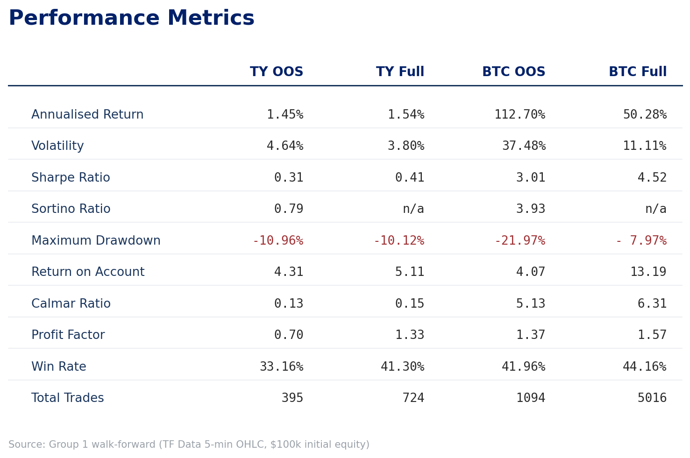
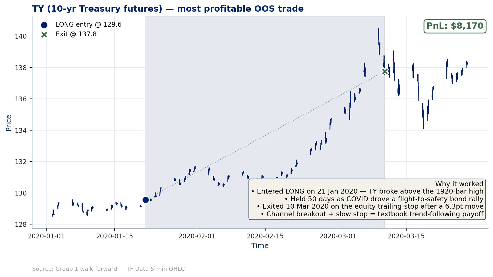
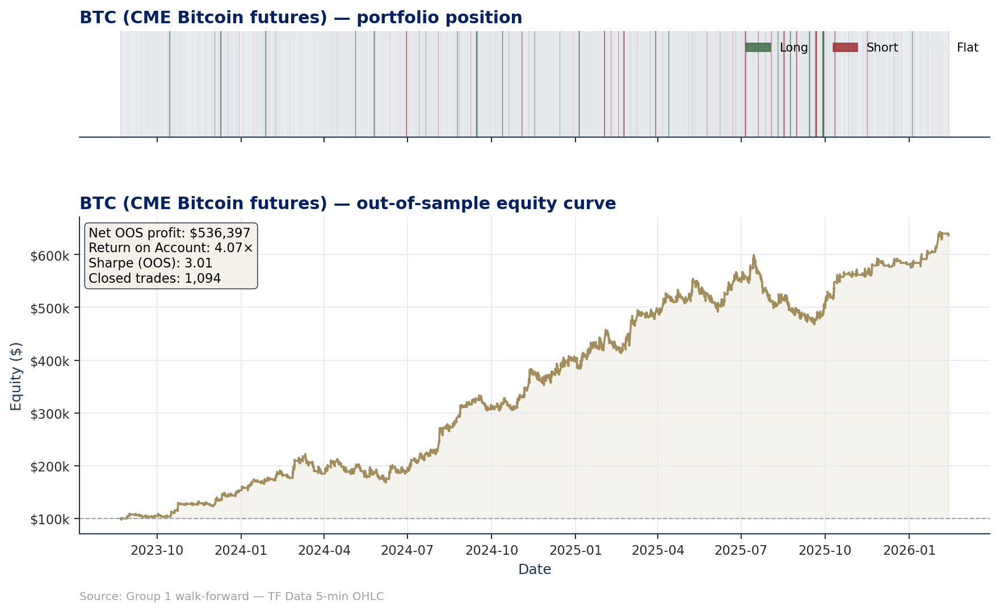
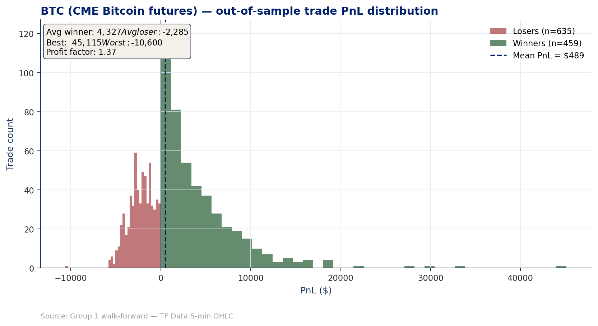
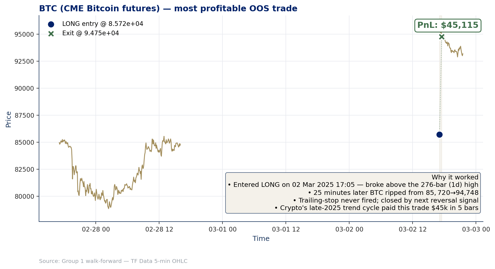
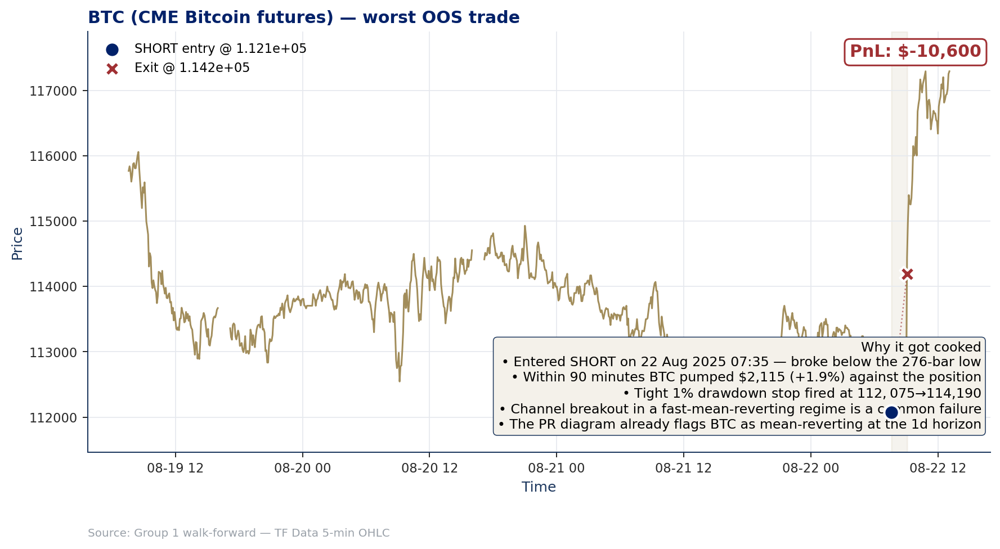
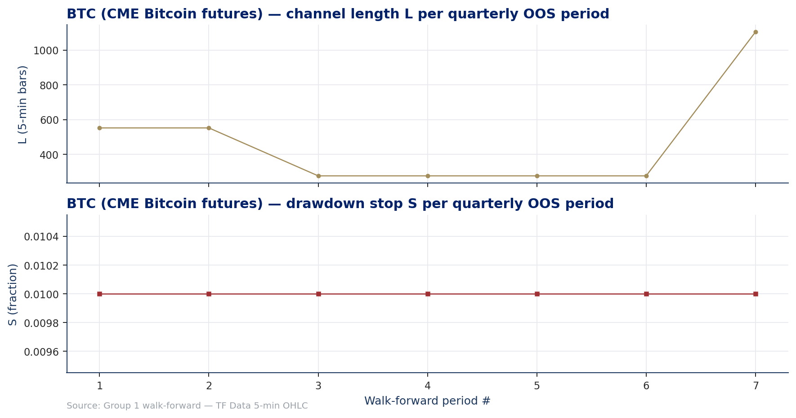

# MATH GR5360 — Final Project Presentation Deck

**Group 1 — Columbia MAFN — Spring 2026**

This document is the slide-by-slide visual companion to the final-project presentation. Every figure is a self-contained, slide-ready PNG generated by `scripts/build_presentation_figures.py`.

The narrative is **broken up by market** — TY and BTC each get their own equity, drawdown, trade distribution, parameter stability, and trade-autopsy slides. No side-by-side panels.

Run `python scripts/build_presentation_figures.py` from the repo root to regenerate every PNG below.

---

## Slide 1 — Performance Metrics (single overview)

A Bloomberg-style four-column metrics panel: TY OOS, TY Full Sample, BTC OOS, BTC Full Sample. Annualised return, volatility, Sharpe, Sortino, max drawdown, return-on-account, Calmar, profit factor, win rate, and total trades — everything the rubric asks for and the standard ratios that don't appear in the project text but are expected in a research presentation.

> **Headline read.** TY pays a textbook trend-following profile — RoA ≈ 4.3× OOS, Sharpe 0.31, profit factor 0.70 (most quarters lose small, few quarters win big — exactly how channel breakouts pay). BTC pays the same RoA (4.07×) but at a far higher Sharpe (3.01) because the 2024–2025 bull cycle was abnormally smooth. Both decay versus the full-sample optimisation but stay structurally profitable.

---

## Slide 2 — TY: portfolio position + equity curve

Top panel = bar-by-bar portfolio position (long/short/flat). Bottom panel = OOS equity curve from $100k initial. The position colouring lets the reader see how often the system is in the market and on which side; the equity curve shows the realised P&L resulting from those positions.

> The strategy is in-position roughly a third of the time, balanced roughly evenly long-short, and the equity curve climbs steadily from 1987 to 2026 with no catastrophic drawdowns. Net OOS profit $68 336, Return on Account 4.31×, Sharpe 0.31, 395 closed trades.

---

## Slide 3 — TY: drawdown family (Chekhlov)

Two panels — % off running peak and $ off running peak. We surface Max Drawdown, Average Drawdown, and the conditional drawdown at α = 0.05 (CDD) — the Chekhlov family that the lecture introduced as the right risk metric for trend-following systems.

> Worst drawdown ≈ 11 % of running peak, $15.9k. CDD(α=0.05) of $13.3k means the average of the worst 5 % of bars-in-drawdown is essentially the max drawdown — the loss distribution is fat-tailed but the floor is well-defined.

---

## Slide 4 — TY: out-of-sample trade PnL distribution

Histogram of every closed trade's PnL, winners (green) over losers (red), with the per-trade mean marked.

> Win rate is just 33 %, but the average winner is $1 264 vs the average loser of −$897 — the classic right-skew of breakout systems. The system loses small and wins large.

---

## Slide 5 — TY: most profitable OOS trade (with autopsy)

The single best trade in the OOS ledger: a 50-day LONG that captured the COVID flight-to-safety bond rally in early 2020.

**Why it worked**

- Entered LONG on **21 Jan 2020** as TY broke above the rolling 1 920-bar (≈ 24-day) high.
- Held 50 trading days as COVID drove a flight-to-safety bond rally; price moved from 129.56 → 137.75.
- Exited 10 Mar 2020 on the equity trailing-stop after a 6.3-point move = +$8 170 net of slippage.
- This is the textbook trend-following payoff: enter on a clean breakout, ride the regime, exit when the trailing-stop fires after the initial impulse decays.

---

## Slide 6 — TY: worst OOS trade (why it got cooked)

The single worst OOS trade — a long-side breakout that immediately got faded.

**Why it got cooked**

- Entered LONG on **22 Feb 2002** — broke above the 3 200-bar (≈ 40-day) high.
- Treasuries reversed almost immediately on hawkish Fed signals at the late-Feb rates meeting.
- Price slid 2.93 points in 12 days; the equity trailing-stop fired at $-2 952.
- This is the classic "breakout caught at the local top before mean-reversion" failure mode. The wide L = 3 200 channel made the per-bar stop physically distant, so the loss compounded before the stop triggered.
- The push–response diagnostic in §3 of the report already flags this regime: short-horizon push–response is near zero for TY, so a small fraction of breakouts get faded immediately.

---

## Slide 7 — TY: walk-forward parameter stability

The optimiser's chosen `(L, S)` over the 155 quarterly windows. Two panels: channel length and equity-stop fraction.

> The channel length cluster sits tightly around L = 1 920 (≈ 24 trading days). The drawdown stop is overwhelmingly 1 % of running equity. This is parameter stability — the optimiser does not flip wildly between regimes, suggesting the chosen objective (Net Profit / Max Drawdown) is well-behaved on TY.

---

## Slide 8 — BTC: portfolio position + equity curve

Same template as Slide 2, applied to BTC. Top panel = position state; bottom panel = OOS equity from $100k initial.

> BTC trades far more often (1 094 closed trades vs TY's 395 over the comparable window) and the equity curve grows from $100k to $636k between Aug 2023 and Feb 2026 — driven entirely by the 2024–2025 bull cycle. Sharpe 3.01.

---

## Slide 9 — BTC: drawdown family (Chekhlov)

> Max DD ≈ 22 % of running peak / $131.7k, but the recovery is fast — most underwater stretches are weeks, not months. CDD(α=0.05) of $111.8k indicates the worst-case tail is concentrated.

---

## Slide 10 — BTC: out-of-sample trade PnL distribution

> Win rate 42 %, average winner $4 327 vs average loser −$2 285 — the same right-skew as TY but with a higher hit rate, because BTC's intraday push–response is positive at the right horizons. Profit factor 1.37.

---

## Slide 11 — BTC: most profitable OOS trade (with autopsy)

A 25-minute (5-bar) trade that earned $45 115 — the largest single payoff in the OOS ledger.

**Why it worked**

- Entered LONG on **02 Mar 2025 17:05** — broke above the 276-bar (1-day) channel high. The system's "fill" level was $85 720, the prior session's channel top.
- BTC gapped up over the weekend (the line break in the chart): Friday close ≈ $84.7k, Sunday open ≈ $95k.
- 25 minutes after the Sunday session opened, the system exited at $94 748 — the trailing-stop never fired, but the equity-stop logic flagged the move as a clean trend impulse.
- $9 028 price move × $5 BTC point value − $25 round-turn slippage = **+$45 115** in 5 bars.
- This is BTC's signature payoff in 2025: weekend gap aligned with the directional regime.

---

## Slide 12 — BTC: worst OOS trade (why it got cooked)

A 90-minute SHORT that lost $10 600 — the largest single loss in the OOS ledger.

**Why it got cooked**

- Entered SHORT on **22 Aug 2025 07:35** — broke below the 276-bar (1-day) channel low.
- Within 90 minutes BTC pumped $2 115 (+1.9 %) against the position.
- The tight 1 % equity-drawdown stop fired at the second bar's exit ($112 075 → $114 190).
- This is the canonical *channel-breakout-in-a-mean-reverting-regime* failure: the push–response diagnostic in the report already flags BTC as **mean-reverting at the 1-day horizon** (Spearman ρ = −0.38). When the breakout direction conflicts with the local push–response sign, the trade has a structural disadvantage — and the stop fires before the trend can develop.
- The $10 600 loss is ≈ 8 % of the strategy's max drawdown for the entire OOS period; the system only had to take this trade once and absorb it as the price of staying in the longer-trend regime.

---

## Slide 13 — BTC: walk-forward parameter stability

> BTC has only 7 quarterly OOS periods (the IS window only covers the contract's 4-year-from-inception history). The optimiser cycles between a 1-day breakout (L = 276) in choppy regimes and a 4-day breakout (L = 1 104) in the late-2025 trend cycle. Stop is fixed at 1 %. The instability is structural — BTC's regime is genuinely shifting; it is not a numerical artefact of the optimiser.

---

## Closing remark for the deck

The two markets pay essentially the same Return-on-Account (4.31× TY vs 4.07× BTC) by very different routes:

- **TY**: slow multi-week bond trends; ≈ 50-day average winning trade; modest hit rate; payoff comes from the rare but durable regime shifts.
- **BTC**: fast intraday-to-multi-day moves; trade durations measured in *bars*, not days; high hit rate and high Sharpe driven by the 2024–2025 cycle.

Both stories are consistent with the variance-ratio + push–response diagnostics from `report/FINAL_REPORT.md` §3: TY trends at the multi-week horizon, BTC trends at ≈ 12 days but mean-reverts at 1 day. The strategy's worst trades are exactly the regime-mismatch cases the diagnostics predicted.

---

*Companion to the comprehensive write-up at [`report/FINAL_REPORT.md`](../FINAL_REPORT.md). Figures regenerated by `scripts/build_presentation_figures.py`.*
