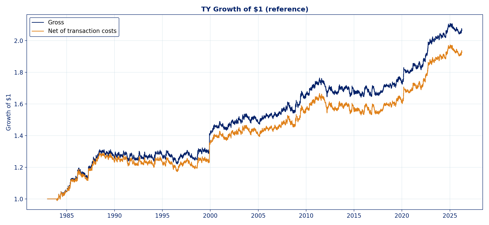
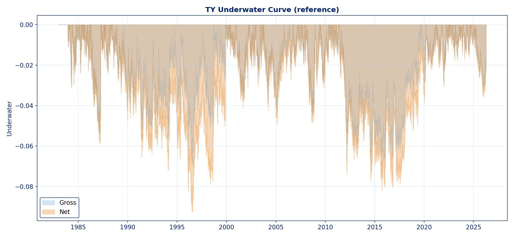
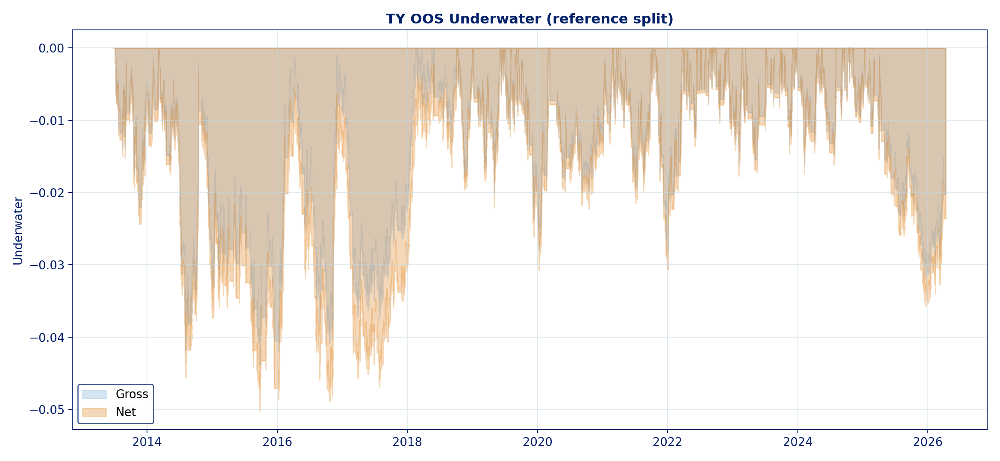
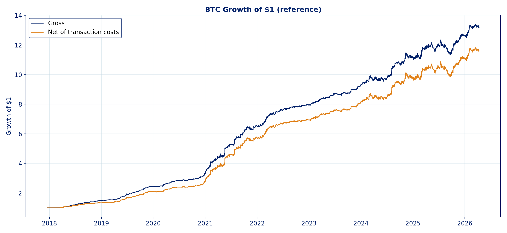
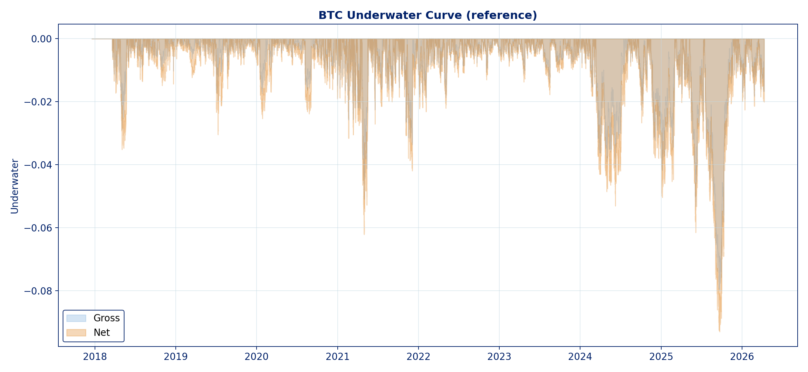
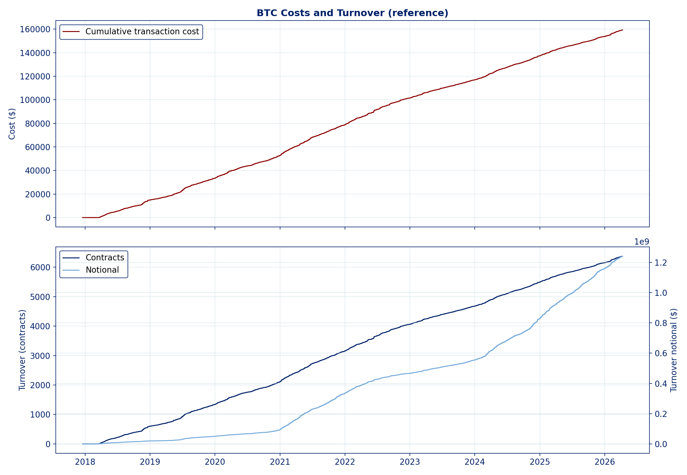
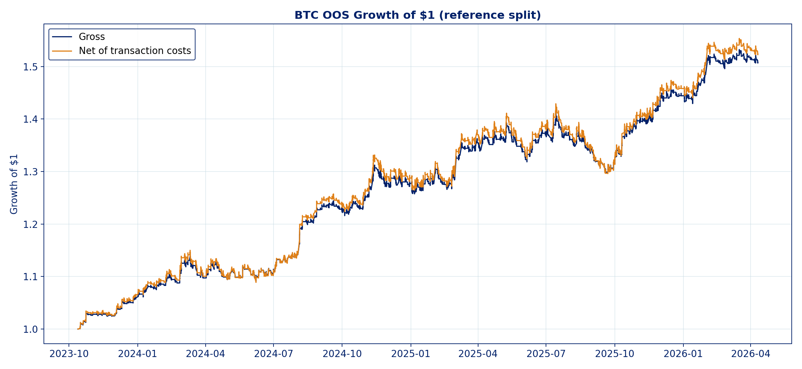
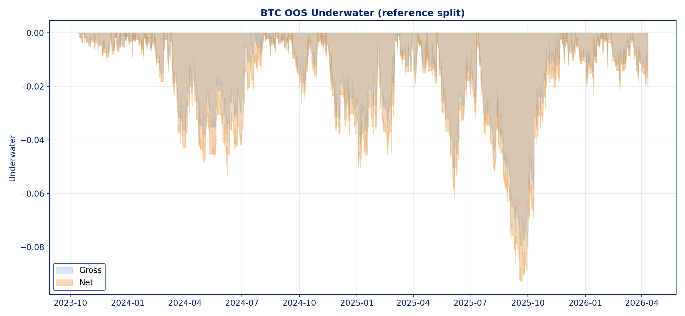

# Final Report Extract

## 1. Experimental Setup

- Strategy: `Channel WithDDControl` trend-following system.
- Markets:
  - Primary: `TY` (10-Year Treasury Note futures)
  - Secondary: `BTC` (CME Bitcoin futures)
- Data frequency: `5-minute` OHLC bars.
- Session handling:
  - `TY` uses the project liquid-session filter already embedded in the engine.
  - `BTC` uses the full 24-hour series.
- Walk-forward assignment experiment:
  - In-sample window `T = 4 years`
  - Out-of-sample window `tau = 1 quarter`
  - Each quarter is optimized on the immediately preceding 4 years and then traded on the adjacent next quarter.
- Optimization target: `Net Profit / Max Drawdown` (`RoA`).
- Transaction-cost assumptions used in the backtest:
  - `TY`: `$18.625` round-turn per contract
  - `BTC`: `$50.00` round-turn per contract
- Important reporting note:
  - The walk-forward OOS equity curve is marked to market bar by bar.
  - The OOS trade table contains only closed trades.
  - Therefore, quarter-end unrealized P&L can make equity-curve performance measures stronger or weaker than trade-table summaries in a given run.
  - For the assignment, the primary headline comparison should therefore use the OOS equity-curve statistics (`Net Profit`, `Max Drawdown`, `RoA`, return volatility, Sharpe), with trade-level metrics presented as complementary diagnostics.

## 2. Walk-Forward Out-of-Sample Results

### TY walk-forward OOS

- Date range: `06/29/1987 12:40` to `03/18/2026 11:15`
- OOS periods: `153`
- Story / modal configuration: `L = 1440`, `S = 0.01`
- Net Profit: `$47,618.66`
- Net Max Drawdown: `$30,234.59`
- Net RoA: `1.575`
- Annualized net return: `1.14%`
- Annualized net volatility: `5.02%`
- Annualized net Sharpe: `0.228`
- Closed trades: `403`
- Win rate: `31.27%`
- Average winner: `$1,176.62`
- Average loser: `-$920.53`
- Profit factor: `0.581`
- Average trade duration: `922.9` bars
  - roughly `11.5` TY sessions
- Total transaction cost paid: `$8,576.81`
- Turnover: `921.0` contracts

### BTC walk-forward OOS

- Date range: `11/19/2023 21:05` to `02/08/2026 23:15`
- OOS periods: `6`
- Story / modal configuration: `L = 288`, `S = 0.01`
- Net Profit: `$465,260.50`
- Net Max Drawdown: `$140,383.75`
- Net RoA: `3.314`
- Annualized net return: `125.12%`
- Annualized net volatility: `44.17%`
- Annualized net Sharpe: `2.833`
- Closed trades: `1,005`
- Win rate: `41.39%`
- Average winner: `$4,464.16`
- Average loser: `-$2,365.88`
- Profit factor: `1.333`
- Average trade duration: `33.0` bars
  - about `2.75` trading days
- Total transaction cost paid: `$50,275.00`
- Turnover: `2,011.0` contracts

## 3. Full-Sample Comparison

### TY full-sample

- Full-sample configuration: `L = 1440`, `S = 0.01`
- Net Profit: `$85,134.72`
- Net Max Drawdown: `$15,273.13`
- Net RoA: `5.574`
- Annualized net return: `1.53%`
- Annualized net volatility: `3.87%`
- Annualized net Sharpe: `0.396`
- Closed trades: `719`
- Win rate: `41.31%`
- Average winner: `$1,168.21`
- Average loser: `-$620.43`
- Profit factor: `1.325`

### BTC full-sample

- Full-sample configuration: `L = 288`, `S = 0.01`
- Net Profit: `$1,605,307.00`
- Net Max Drawdown: `$140,383.75`
- Net RoA: `11.435`
- Annualized net return: `51.23%`
- Annualized net volatility: `12.09%`
- Annualized net Sharpe: `4.237`
- Closed trades: `4,881`
- Win rate: `43.29%`
- Average winner: `$2,185.60`
- Average loser: `-$1,088.59`
- Profit factor: `1.533`

## 4. OOS vs Full-Sample Decay

### TY

- OOS / full-sample net profit ratio: `0.559`
- OOS / full-sample net RoA ratio: `0.283`
- OOS / full-sample trade-count ratio: `0.561`

### BTC

- OOS / full-sample net profit ratio: `0.290`
- OOS / full-sample net RoA ratio: `0.290`
- OOS / full-sample trade-count ratio: `0.206`

Interpretation:

- `TY` remains profitable OOS, but the OOS RoA is much weaker than the full-sample benchmark.
- `BTC` remains strongly profitable OOS, but still shows material decay relative to the in-sample / full-history fit.

## 5. Parameter Behavior by Quarter

### TY

- Most frequent quarterly selections:
  - `L = 1440, S = 0.01` selected `19` times
  - `L = 1920, S = 0.04` selected `18` times
  - `L = 1920, S = 0.03` selected `13` times
- Interpretation:
  - TY prefers longer horizons.
  - The most common lookbacks are around `1440` to `1920` bars, which is consistent with the professor’s “longer-horizon trend-following” story for Treasuries.

### BTC

- Most frequent quarterly selections:
  - `L = 288, S = 0.01` selected `4` times
  - `L = 576, S = 0.01` selected `1` time
  - `L = 1152, S = 0.01` selected `1` time
- Interpretation:
  - BTC prefers much faster trend horizons than TY.
  - This matches the narrative that BTC’s trend-following inefficiency is easier to see at shorter horizons.

## 6. Best and Worst OOS Quarters

### TY

- Best OOS quarter by net objective:
  - Period `44`
  - `07/07/1998` to `10/06/1998`
  - `L = 1920`, `S = 0.03`
  - Net Profit: `$7,347.06`
  - Net MaxDD: `$1,781.25`
  - Net Objective: `4.125`

- Worst OOS quarter by net objective:
  - Period `105`
  - `12/26/2013` to `03/27/2014`
  - `L = 3200`, `S = 0.04`
  - Net Profit: `-$5,109.06`
  - Net MaxDD: `$5,365.38`
  - Net Objective: `-0.952`

### BTC

- Best OOS quarter by net objective:
  - Period `6`
  - `09/24/2025` to `02/08/2026`
  - `L = 1152`, `S = 0.01`
  - Net Profit: `$127,821.25`
  - Net MaxDD: `$18,918.75`
  - Net Objective: `6.756`

- Worst OOS quarter by net objective:
  - Period `5`
  - `05/14/2025` to `09/24/2025`
  - `L = 288`, `S = 0.01`
  - Net Profit: `-$69,686.25`
  - Net MaxDD: `$140,383.75`
  - Net Objective: `-0.496`

## 7. Matlab-Parity Reference Split Appendix

These are useful as implementation-validation / appendix results rather than the main assignment walk-forward result.

### TY reference split

- Auto split:
  - In-sample: `01/03/1983` to `06/26/2013`
  - OOS: `06/27/2013` to `04/10/2026`
  - `barsBack = 17001`
- Best reference configuration: `L = 1280`, `S = 0.01`
- Reference OOS net profit: `$32,191.25`
- Reference OOS net max drawdown: `$13,650.44`
- Reference OOS net RoA: `2.358`

### BTC reference split

- Auto split:
  - In-sample: `12/18/2017` to `10/12/2023`
  - OOS: `10/13/2023` to `04/10/2026`
  - `barsBack = 17001`
- Best reference configuration: `L = 576`, `S = 0.01`
- Reference OOS net profit: `$398,854.75`
- Reference OOS net max drawdown: `$101,235.25`
- Reference OOS net RoA: `3.940`

## 8. Embedded Figures For The Report / Slides

### TY figures

These figures support the Treasury narrative: weaker short-horizon behavior, but a viable slower trend-following profile at longer horizons.

| Growth of $1 | Underwater |
|---|---|
|  |  |

| Costs and turnover | Reference OOS growth of $1 |
|---|---|
|  |  |

| Reference OOS underwater |
|---|
|  |

### BTC figures

These figures support the Bitcoin narrative: stronger and faster trend-following, higher turnover, and larger gross and net performance swings.

| Growth of $1 | Underwater |
|---|---|
|  |  |

| Costs and turnover | Reference OOS growth of $1 |
|---|---|
|  |  |

| Reference OOS underwater |
|---|
|  |

## 9. Supporting Files

- Core metrics table: [report_core_metrics.csv](report_core_metrics.csv)
- C++ master summary: [tf_backtest_summary.csv](../results_cpp/tf_backtest_summary.csv)
- Overview report table: [cpp_backtest_report_overview.csv](cpp_backtest_report_overview.csv)

## 10. Sources And Assumptions

### Project sources

- [Final Project MATH GR5360.pdf](../Final%20Project%20MATH%20GR5360.pdf)
- professor-provided `main.m` and `ezread.m`
- course lecture material on Variance Ratio, Push-Response, and drawdown-family measures

### Transaction-cost / contract references used for the rendered C++ examples

- [CME Treasury contract specifications](https://www.cmegroup.com/education/courses/introduction-to-treasuries/understand-treasuries-contract-specifications.hideHeader.hideFooter.hideSubnav.hideAddThisExt.educationIframe.html.html)
- [BIS Treasury market liquidity paper](https://www.bis.org/publ/cgfs11flem.pdf)
- [CME Bitcoin futures rulebook](https://www.cmegroup.com/content/dam/cmegroup/rulebook/CME/IV/350/350.pdf)
- [CME Bitcoin liquidity materials](https://www.cmegroup.com/education/bitcoin/futures-liquidity-report.html)
- [CME fee / clearing references](https://www.cmegroup.com/company/clearing-fees.html)

### Important assumption note

- The assignment says the final slippage should come from the professor-provided parameter sheets.
- The rendered C++ example run documented here used the conservative defaults embedded in the binary:
  - `TY`: `$18.625` round-turn
  - `BTC`: `$50.00` round-turn
- If the group wants strict final submission parity with the course parameter tables, rerun the binary with explicit transaction-cost overrides.
